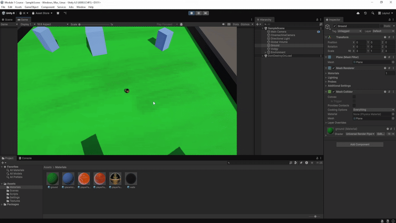

# Unity-DodgeGame 🎮

Este projeto foi desenvolvido durante o **Módulo 2 do curso de Unity**, com foco na criação de um jogo simples de **desviar de obstáculos**. O objetivo é praticar conceitos fundamentais da Unity e da linguagem C#, construindo uma base sólida para projetos mais avançados.

## 🚀 Funcionalidades Aprendidas
- Estrutura básica com **Start() e Update()**
- Uso de **variáveis** e `[SerializeField]`
- **Input com GetAxis()**
- Controle de movimento com **Time.deltaTime**
- Introdução ao **Cinemachine** para câmeras
- Sistema de **colisões** (OnCollisionEnter)
- Criação e uso de **métodos**
- Manipulação de **componentes** com GetComponent()
- Implementação de **pontuação**
- Uso de **Time.time** para lógica de jogo
- Estruturas condicionais **if statements**
- Referências, tags e rotação de objetos
- **Prefabs** e ordem de execução
- Construção do **layout do nível** e adição de obstáculos
- Finalização e organização do jogo

## 🎯 Objetivo do Jogo
O jogador deve controlar o personagem e **evitar obstáculos** enquanto sobrevive o máximo de tempo possível.

## 🛠️ Tecnologias
- **Unity** (Motor de jogo)
- **C#** (Linguagem de programação)

---
- Este é um projeto de aprendizado, servindo como base para aprofundar conhecimentos em desenvolvimento de jogos com Unity.
- Em desenvolvimento!
